# SysAuditKit 🐧

> Outil d'audit et de gestion système pour Linux (Debian/Ubuntu).
> Projet académique - École Marocaine des Sciences de l'Ingénieur (EMSI).


---

## 📋 Contexte du Projet

Dans le cadre du module **Système d'exploitation Linux** (3ème Année IIR), ce projet vise à concevoir un outil automatisé permettant aux administrateurs systèmes d'initialiser des machines, de gérer les utilisateurs, d'analyser les logs et de surveiller les processus.

L'outil est livré sous forme de paquet Debian (`.deb`) installable via `dpkg` ou `apt`.

## 🚀 Fonctionnalités

**SysAuditKit** propose 4 modules principaux accessibles via la commande `sysauditkit <module>` :

### 1. Module `init` (Initialisation)
* Création automatique d'un utilisateur étudiant basé sur `prenom.nom`.
* Génération d'un dossier de travail sécurisé (`chmod 700`).
* Traçabilité des actions dans les logs système.

### 2. Module `report` (Rapport Système)
* Génération d'un rapport textuel dynamique avec un entête formaté.
* Inclut : Info OS, Usage Disque, Utilisateurs connectés, Top Processus (CPU/MEM).

### 3. Module `search` (Recherche & Analyse)
* Recherche de fichiers multicritères (type, extension).
* Analyse de contenu via `grep` (récursif, insensible à la casse).
* **Mode combiné :** Utilisation conjointe de `find` et `grep` pour une analyse ciblée.

### 4. Module `monitor` (Surveillance)
* Affichage des processus d'un utilisateur spécifique.
* Gestion interactive des processus : `kill` (tuer) ou `renice` (changer la priorité).

---

## 🛠️ Architecture Technique

### Structure du Paquet
Le projet respecte l'arborescence standard Debian :

```bash
sysauditkit/
├── DEBIAN/
│   └── control          # Métadonnées du paquet
├── usr/
│   └── bin/
│       └── sysauditkit  # Script principal (exécutable)
├── etc/
│   └── sysauditkit/     # Fichiers de configuration (owner.conf)
└── var/
    └── log/
        └── sysauditkit/ # Journaux d'audit
```
### Justifications Techniques
* **Permissions** : L'outil force l'exécution en `root` (via `sudo`) pour garantir l'accès aux commandes d'administration (`useradd`, `renice`) et l'écriture dans `/var/log`.
* **Recherche Combinée** : Nous utilisons la syntaxe `find ... -exec grep ... {} +` plutôt qu'un pipe `|`. Cela assure une meilleure gestion des fichiers contenant des espaces et optimise les performances en passant plusieurs fichiers à `grep` en une seule fois.

## 📦 Installation et Utilisation
## Prérequis
* Un système basé sur Debian (Ubuntu, Linux Mint, Kali, etc.).
* Droits root (`sudo`).
## Installation
Téléchargez le fichier `.deb` et installez-le :
```bash
sudo dpkg -i sysauditkit.deb
```
## Commandes
Une fois installé, l'outil est disponible globalement :
### Initialiser un étudiant
```bash
sudo sysauditkit init
```
### Générer un rapport d'état
``` bash
sudo sysauditkit report
```
### Rechercher des fichiers suspects
```bash
sudo sysauditkit search
```
### Surveiller les processus
```bash
sudo sysauditkit monitor
```
### Désinstallation
Pour retirer proprement l'outil du système :
```bash
sudo dpkg -r sysauditkit
```
## 📸 Captures d'écran
* Installation du paquet <br>
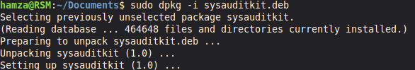

* installation status <br>
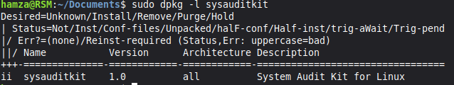

* init module <br>
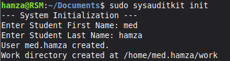

* init result <br>
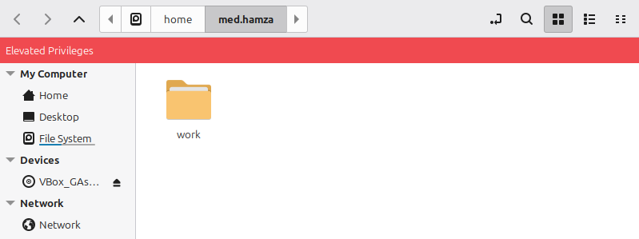

* monitor module <br>
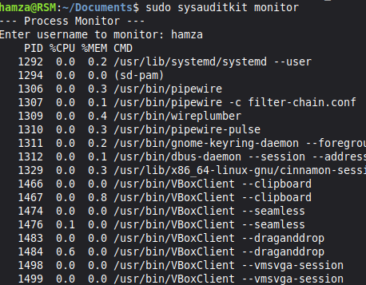<br>
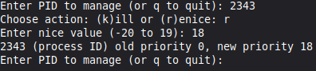

* Repport module <br>
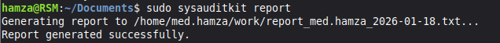

* Repport result <br>
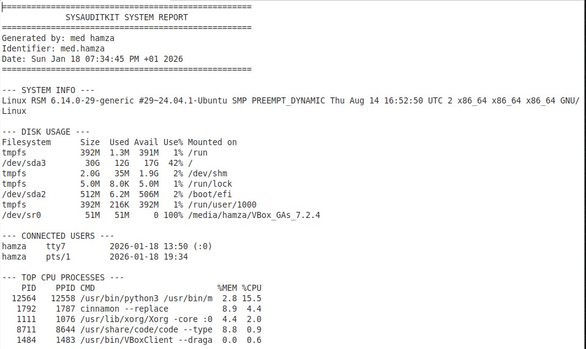

* Search module <br>
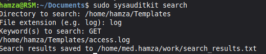

* Search result <br>
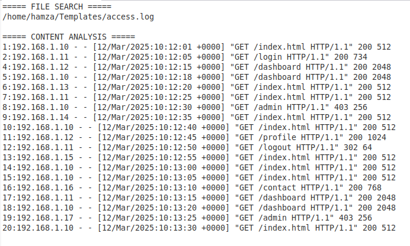

* Unistall <br>
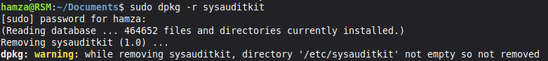
